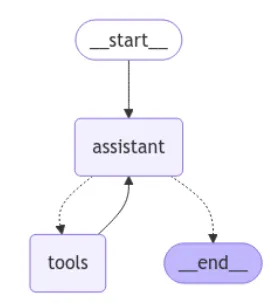

# 🧠 FastAPI ReAct Assistant

Assistente Conversacional que utiliza um **Agente ReAct** para responder perguntas sobre produtos e SAC, combinando **consulta em SQL** e/ou **busca semântica**.  
O projeto inclui:

✅ **FastAPI** como backend HTTP  
✅ **LangGraph + LangChain** para criação do agente ReAct  
✅ **Ollama** como servidor local de modelos LLM e embeddings  
✅ **ChromaDB** como banco vetorial do SAC e dos nomes dos produtos  
✅ **SQLite** para persistir histórico de conversas e armazenar o catálogo de produtos

---

🧩 Visão Geral

O projeto implementa um Agente ReAct que combina raciocínio e ações a partir de diferentes fontes de dados para responder perguntas relacionadas ao catálogo e ao serviço de atendimento ao cliente da C&A.

⸻

🖼️ Arquitetura do Agente

A arquitetura de um agente ReAct pode ser representada por um grafo, contendo um nodo de assistente e outro de ferramentas, conforme imagem abaixo. 

O agente ReAct segue a seguinte lógica:
	1.	Recebe a pergunta do usuário
	2.	Analisa o contexto e o histórico
	3.	Decide quais ferramentas utilizar
	4.	Executa buscas SQL ou semânticas
	5.	Combina e organiza a resposta final

⸻

🛠️ Ferramentas Utilizadas

O agente conta com duas ferramentas principais:

- Busca SQL de Produtos do catálogo: Realiza consultas estruturadas na base de dados SQLite para retornar informações detalhadas sobre produtos, como preço, título e descrição.
- Busca Semântica de Produtos e SAC: Banco vetorial criado com o ChromaDB, utilizando um modelo local de embeddings do Ollama. Foram criadas duas collections distintas:
 	- Catálogo: Nos casos em que o cliente não sabe o nome exato de um produto, realiza a busca por similaridade semântica entre a necessidade informada pelo cliente e 	as descrições dos produtos;
 	- SAC: Usado para recuperar respostas às perguntas mais frequentes sobre o Serviço de Atendimento ao Consumidor, incluindo assuntos como políticas de reembolso, 	prazos de entrega e devolução/troca de produtos.

⸻

## 🖥️ :computer: Requisitos

- :snake: [**Python 3.10+**](https://www.python.org/downloads/)
- :whale: [**Docker**](https://www.docker.com/products/docker-desktop/)
- [**Ollama**](https://ollama.com/download) (Para rodar modelos de LLM e embeddings)

⸻

🏃 :pushpin: Rodando localmente

Antes de tudo, certifique-se de que o Ollama está rodando e de que os modelos foram baixados.

📥 Clone o repositório

        git clone https://github.com/bernardofm93/fastapi-react-assistant.git

⸻

🧰 Instale as dependências

        python -m venv .venv
        source .venv/bin/activate
        pip install -r requirements.txt

⸻

🤖 Baixe modelos no Ollama

        ollama pull llama3.1
        ollama pull granite-embeddings:278m

⸻

🗃️ Preprocessamento inicial

Gera o banco de produtos (produtos.db) e popula o ChromaDB com embeddings:

        python -m app.db.preprocess

⸻

🚀 Suba a API

        uvicorn app.main:app --reload

Por padrão, estará disponível em:

http://localhost:8000

⸻

📚 Endpoints

🔹 POST /chat/

Envia uma pergunta e recebe a resposta do assistente.

Exemplo de Request body:

        {
        "question": "Quais calças custam menos de 200 reais?",
        "thread_id": "thread-123"
        }

⸻

🔹 GET /historico/{thread_id}

Recupera todo o histórico da conversa a partir do ID da thread.

⸻

🔹 Swagger Docs

Interface interativa:

http://localhost:8000/docs

⸻

🐳 :whale: Docker

Rodando via Docker Compose.

⸻

🛠️ Build da imagem

        docker build -t fastapi-react-assistant .

⸻

🚀 Run com Docker

Certifique-se que o Ollama está rodando no host e passe o .env:

        docker run -d --env-file .env -p 8000:8000 --name assistant fastapi-react-assistant

⸻

🧠 Exemplos de uso com cURL

Enviar pergunta:

        curl -X POST "http://localhost:8000/chat/" \
        -H "Content-Type: application/json" \
        -d '{"question":"Quantos produtos custam abaixo de 200 reais?","thread_id":"teste"}'

Consultar histórico:

        curl "http://localhost:8000/historico/teste

⸻

📓 🧪 Testando em Jupyter Notebook

Caso seja mais acessível, é possível realizar o teste no arquivo **teste_agente.ipynb**. 
